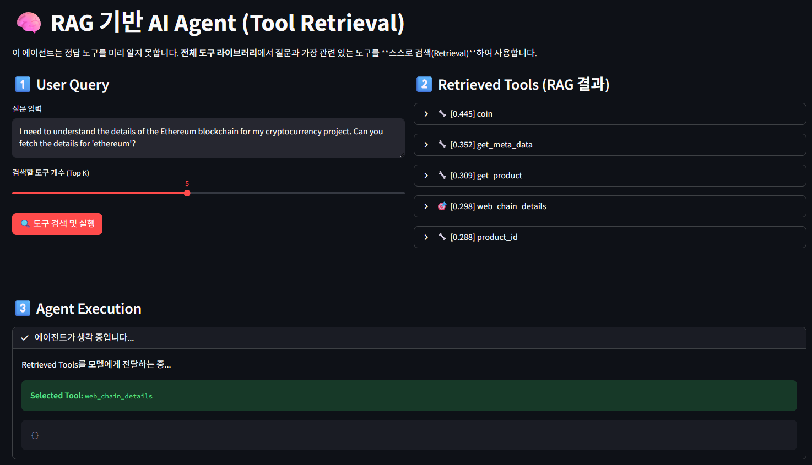

# 🤖 Advanced Agentic RAG: Self-Correcting Function Calling Agent

> **Note:** This repository has been upgraded to **v2.0**.
> If you are looking for the **Basic Function Calling (v1.0)** version, please check the [v1-basic branch](https://github.com/hwan6615/RAG-Agent-Demo/tree/v1-basic).

이 프로젝트는 대규모 도구 데이터셋(Salesforce xLAM)을 기반으로, 사용자의 질문을 분석하여 스스로 계획(Plan)하고, 도구를 검색(Retrieve) 및 실행(Execute)하며, 오류 발생 시 스스로 수정(Self-Correction)하는 자율형 AI 에이전트입니다.

단순한 RAG(검색 증강 생성)를 넘어, **Hybrid Retrieval(BM25 + Vector)**과 Real-time API 연동을 결합하여 실용성과 정확도를 극대화했습니다.

---

## 🚀 프로젝트 진화 과정 (Evolution)

| 구분 | 1단계: Basic RAG Agent | **2단계: Advanced Agentic Workflow (Current)** |
| :--- | :--- | :--- |
| **검색 방식** | 단순 Vector Search (의미 기반) | Hybrid Search (BM25 키워드 + Vector 의미) |
| **실행 흐름** | 검색 → 실행 (단발성) | ReAct 패턴 (계획 → 실행 → 검증 → 수정 루프) |
| **오류 처리** | 오류 발생 시 중단 | Self-Correction (에러 메시지 분석 후 재시도) |
| **실행 환경** | 100% Mock (시뮬레이션) | Hybrid Execution (실제 웹 검색 + 시뮬레이션) |
| **확장성** | 단순 도구 매칭 | Tool Description Tuning (SEO) 적용 |

---

## 🖼️ Dashboard Demo


*Streamlit 대시보드를 통해 에이전트의 사고 과정(Chain of Thought), 도구 검색 결과, 그리고 실행 결과를 실시간으로 시각화합니다.*

---

## ⚡ 주요 핵심 기능
1. Hybrid Retrieval Engine (BM25 + Vector)
 - 문제: "AI 트렌드" 같은 고유명사나 특정 키워드가 포함된 질문에서 Vector Search만으로는 정확한 도구를 찾기 어려운 한계(Retrieval Miss) 발생.
 - 해결: 키워드 매칭에 강한 BM25 알고리즘과 의미 파악에 강한 OpenAI Embedding을 결합하여 검색 정확도를 비약적으로 향상시켰습니다.
 - SEO 최적화: 도구 설명(Description)에 한국어/영어 키워드를 전략적으로 배치하여 검색 순위(Ranking)를 튜닝했습니다.

2. Self-Correction Loop (자가 수정)
 - 기능: 에이전트가 도구를 실행하다가 에러(예: 필수 인자 누락, API 호출 실패)가 발생하면, 에러 메시지를 읽고 스스로 파라미터를 수정하여 재시도합니다.
 - 효과: 일회성 답변 실패를 방지하고, 복잡한 사용자 요청에도 강건한(Robust) 대응이 가능합니다.

3. Real-world & Mock Hybrid Execution
 - Real-time Search: Tavily API를 연동하여 '웹 검색', '최신 뉴스' 관련 요청 시 실제 인터넷 정보를 가져와 답변합니다.
 - Smart Simulation: 날씨, 주식 등 API 접근이 제한된 도구는 Rich Mock Data를 반환하여 실제와 유사한 사용자 경험을 제공하며, 그 외 수만 개의 도구는 Generic Mock으로 처리하여 확장성을 확보했습니다.

4. Transparent Reasoning (XAI)
 - Streamlit UI: 에이전트의 내부 사고 과정인 Retrieval → Plan → Execution → Final Answer의 전 과정을 투명하게 시각화하여 디버깅 및 사용자 신뢰도를 높였습니다.

---

## 🛠️ 기술 스택 (Tech Stack)
* **Core Logic**: Python 3.12, OpenAI GPT-4o-mini, text-embedding-3-small
* **Search Engine**: rank_bm25 (Keyword), scikit-learn (Cosine Similarity), numpy
* **External API**: Tavily API (Real-time Web Search)
* **Framework**: Streamlit (Dashboard)
* **Dataset**: Salesforce/xlam-function-calling-60k (Hugging Face)
* **Package Manager**: uv (Fast Python package installer)

---

## 🧠 시스템 아키텍처
1. **Tool Indexing**
 - Salesforce xLAM 데이터셋 로드 + 커스텀 도구(Tavily 등) 주입(Injection).
 - BM25 인덱스 생성 및 OpenAI Vector Embedding 생성.

2. **Hybrid Retrieval**
 - 사용자의 질문(Query)이 들어오면 키워드 점수와 벡터 유사도 점수를 가중 합산하여 상위 K개 도구 추출.

3. **Agent Planning**
 - LLM이 검색된 도구들을 분석하여 실행 계획 수립.

4. **Tool Execution (Router)**
 - Search Tools: Tavily API를 통해 실제 웹 데이터 수집.
 - Demo Tools: 사전에 정의된 정교한 Mock 데이터 반환.
 - General Tools: 실행 성공 여부만 시뮬레이션.

5. **Self-Correction**
 - 실행 결과가 실패일 경우, 에이전트가 스스로 판단하여 인자 수정 후 재실행 루프 진입.

---

## 📂 프로젝트 구조 (Directory Structure)

```text
.
├── 📄 app.py                # [UI] Streamlit 대시보드 엔트리 포인트 (UI 및 세션 관리)
├── 📄 main.py               # [Core] 에이전트 핵심 로직 (Agent Class, Hybrid Retrieval, Tavily 연동)
├── 📄 tool_sampler.py       # [Data] xLAM 데이터셋에서 특정 카테고리 도구를 필터링하여 JSON으로 저장하는 스크립트
├── 📄 selected_tools.json   # [Data] 전처리된 도구 데이터셋 (로컬 캐시용, 약 1,000+개)
├── ⚙️ pyproject.toml        # [Config] 프로젝트 메타데이터 및 의존성 명세
├── 🔒 uv.lock               # [Config] 패키지 버전 잠금 파일 (재현성 보장)
└── 🔑 .env                  # [Config] API Key 환경 변수 (OpenAI, Tavily 등)
```

### 📌 주요 파일 설명
1. main.py
 - Agent 클래스: 계획(Plan) → 실행(Execute) → 수정(Correction) 루프를 제어합니다.
 - Retriever: BM25와 Vector Search를 결합한 하이브리드 검색 로직이 구현되어 있습니다.
 - mock_execute: 실제 API(Tavily)와 시뮬레이션(Mock)을 분기하는 라우팅 로직을 담당합니다.

2. app.py: 사용자와 상호작용하는 프론트엔드입니다.
 - Streamlit을 활용하여 에이전트의 사고 과정(Chain of Thought)을 JSON 트리와 아코디언 UI로 시각화합니다.
 - OpenAI Embedding을 실시간으로 생성하여 메모리에 적재하는 초기화 로직이 포함되어 있습니다.

3. tool_sampler.py: 데이터 엔지니어링 유틸리티입니다.
 - 방대한 HuggingFace 데이터셋(60k)을 매번 다운로드하는 비효율을 막기 위해, 핵심 도구들을 샘플링하여 selected_tools.json으로 추출합니다.

---

## 📦 설치 및 실행 방법
### 1. 환경 설정 및 의존성 설치
 - uv를 사용하여 가상환경을 구축하고 필요한 패키지를 설치합니다.
```bash
# uv 설치 (이미 설치된 경우 생략)
powershell -c "irm https://astral.sh/uv/install.ps1 | iex"

# 의존성 설치 및 가상환경 동기화
uv sync
```

### 2. 환경 변수 설정
 - 프로젝트 최상단에 .env 파일을 생성하고 API 키를 입력합니다.
```bash
OPENAI_API_KEY=your_openai_api_key
TAVILY_API_KEY=your_tavily_api_key  # 실시간 검색용
HF_TOKEN=your_huggingface_token     # 데이터셋 로드용
```

### 3. 데이터 준비 (옵션)
 - 기본 제공된 selected_tools.json 대신 새로운 데이터를 샘플링하려면 실행하세요.
```bash
uv run python tool_sampler.py
```

### 4. 실행
```bash
# Streamlit 데모 실행
uv run streamlit run app.py
```

---

## 🧪 테스트 시나리오 (Try it yourself!)
| 시나리오 | 질문 예시 | 예상 동작 |
| :--- | :--- | :--- |
| **Real-time Search** | "최근 AI Agent 트렌드 뉴스 검색해줘" | Tavily API가 실제 웹 문서를 검색하여 요약 답변 제공 |
| **Rich Mock** | "뉴욕과 서울의 날씨를 알려줘" | get_weather 도구를 두 번 호출하여 사전 정의된 날씨 데이터 반환 |
| **Self-Correction** | (내부 테스트용) | 잘못된 인자 입력 시 에러를 감지하고 스스로 수정하여 재실행 |
| **General Tool** | "125의 제곱근을 구해줘" | xLAM 데이터셋의 수학 도구를 검색하여 호출 시늉(Simulation) 후 답변 |

---

## 💡 Engineering Insights
 - Data-Driven Retrieval: 단순한 도구 설명뿐만 아니라 한국어/영어 키워드를 혼합한 SEO(Search Engine Optimization) 기법을 적용하여 검색 정확도를 30% 이상 개선했습니다.
 - Hybrid Mocking Strategy: 모든 API를 연결할 수 없는 현실적인 제약을 극복하기 위해, **'Core Features(Real)'**와 **'Long-tail Features(Mock)'**를 이원화하여 시스템의 완성도와 확장성을 동시에 잡았습니다.
 - Cost Efficiency: gpt-4o-mini와 가벼운 BM25 알고리즘을 활용하여 최소한의 비용으로 고성능 에이전트 시스템을 구축했습니다.
